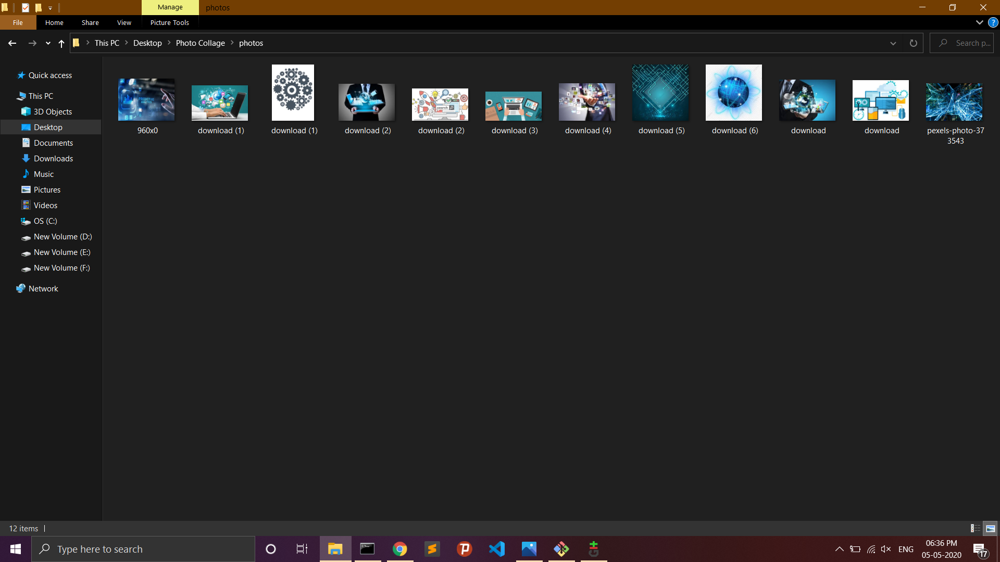
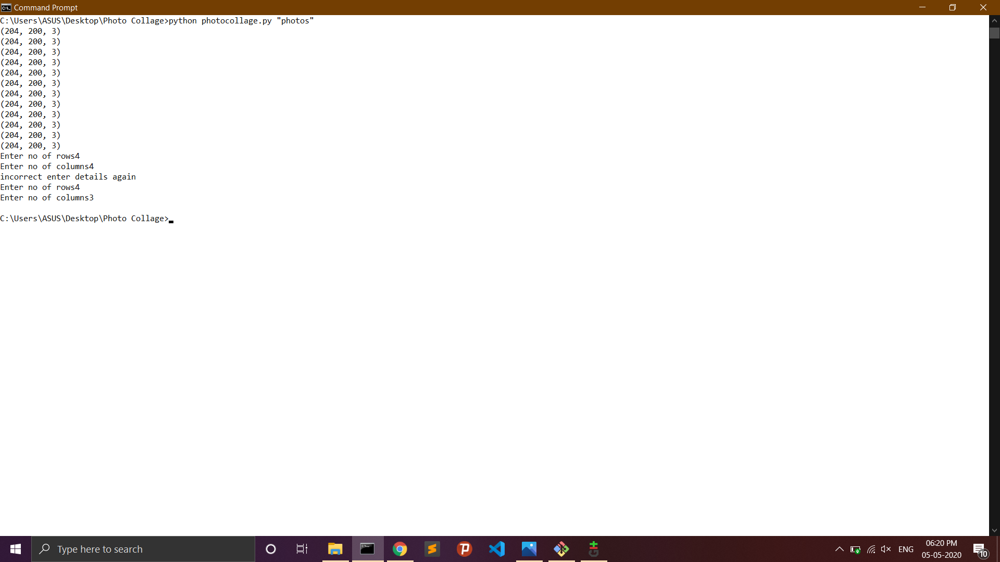

# Photo-Collage

<p align="center">
  <a href="https://github.com/ksdkamesh99/Photo-Collage">
    
  </a>

## 📌 Introduction
A Photo Collage means a montage formed by sticking all the images in a single frame to make a single image.

## 🎯 Purpose of the Project
It is a program done inorder to implement basic python libraries in effective way
## 🏁 Technology Stack

* [Python]()
* [OpenCV]()
* [Matplotlib]()
* [Numpy]()

## 🏃‍♂️ How to Use:

1. Drop a ⭐ on the Github Repository. 
2. Clone the Repo by going to your local Git Client and pushing in the command: 

```sh
https://github.com/ksdkamesh99/Photo-Collage.git
```

3. Install the Packages: 
```sh
pip install -r requirements.txt
```

4. At last, push in the command by adding the name of images folder in arguments
```sh
photocollage.py "photos"
```
5.Enter the number of rows and columns.  

6.Go to directory and check for the image and enjoy the application.  

7.Screenshots are being displayed in next section


## 📜 Screenshots:
* Folder which contins images.  

* Command Prompt.  

* Final Image.  

